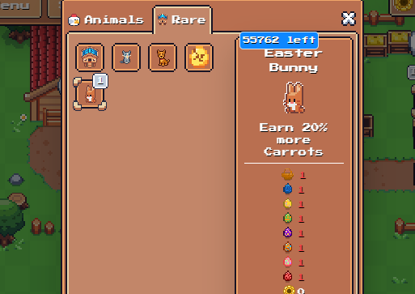

# 复活节活动（结束）

活动结束时间：4月25日-UTC时间：上午9点（北京时间是UTC+8）

<mark style="color:red;">所需材料：5木头+5胡萝卜（1小时成熟期那个）</mark>

<mark style="color:red;">奖励：复活节兔子一只（功能：多赚20%的胡萝卜）</mark>

<mark style="color:red;">备注：兔子和篮子兑换数量为10W，也就是每个人都有，不用担心</mark>

<mark style="color:red;">任务：收集7颗彩蛋，每隔4小时地图会刷新1颗彩蛋</mark>

#### 1.找到铁匠-点击稀有栏，花费5个木头+5个胡萝卜（1小时那个）兑换篮子

**2.每隔4个小时就会出现一枚彩蛋在地图上：**

**3.收集完所有淹死呀所有颜色的彩蛋,去谷仓内兑换复活节兔子**

