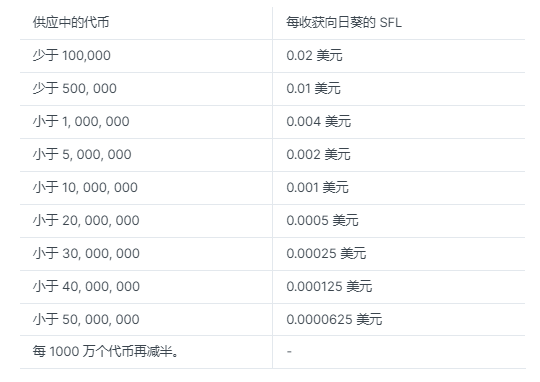
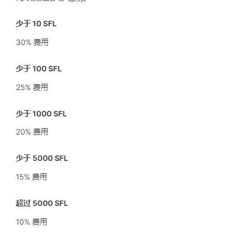

# 🪙 经济模型

目前游戏进行到阶段1，开发了种地、铸造NFT、砍树、养殖、挖矿和技能系统。其中只有种地才能赚取SFL。

SFL是游戏的代币，总供应量有5000万个。每当在游戏中消耗SFL时，SFL会自动打入到黑洞进行销毁。即SFL是采取通缩机制的，每减少1000万个时，价格就会提升，下图是官方给出的价格数据。

该游戏支持 50 多种稀有收藏品和NFT，可以使用 SFL 和其他游戏内资源制作。虽然代币变得越来越稀缺，但所有NFT、工具和其他可制作的物品都保持相同的价格。这确保了这些项目随着时间的推移变得更难获得，并确保对代币的需求保持高位。

例如铸造金蛋需要金、蛋和 SFL。当用户收集到必要的成分时，它们将燃烧接近 300 SFL。

当制作物品时，SFL会发送到黑洞地址销毁。虽然总供应量增加后SFL产量减少，但随着 SFL 被烧毁，循环总量也会减少，SFL会更昂贵。

## 税收制度

提取的代币越多，税收就越低。 这意味着玩长期的农民比玩短期的农民少缴税。

**税收多少按提取SFL的数量区分：**

