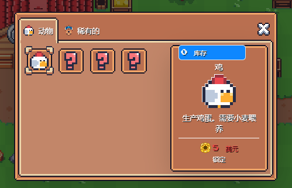

# 谷仓

**谷仓是养殖我们农场小动物的地方，所有小动物都是需要小麦来喂养，所以购买小动物前我们需要先解决小麦的来源。**

**首先我们要**<mark style="color:red;">**去厨房制作一份萝卜馅饼，然后去贿赂地图内的一个小地精，他将教会我们种植小麦的技能，**</mark>**至此我们就可以自己种植小麦来饲养小动物赚钱啦！**

贿赂地精的食物：需要60个胡萝卜和30SFL来制作

