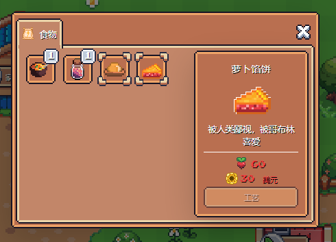

# 土地

**1.首先进入游戏我们可以操作的只有农田。农田分为4部分（下图已做标记），第一块儿农田为系统默认开启供玩家种植赚取收益。**<mark style="color:red;">**其余3块儿需要做好食物给那些霸占土的地精**</mark>

**2.种植向日葵（成熟期1分钟，反复出售购买，嫌麻烦可以种马铃薯（成熟期5分钟））**

<mark style="color:red;">**3.需注意，商店每次存货的种子数量是有限的。当玩家将库存购买为0时，需要点击同步按钮，待验证以后支付0.1Matic gas费后，商店将刷新库存。**</mark>

**同步时，是将数据上传至链上**<mark style="color:red;">**（如果点同步没反应请打开VPN，图片验证是需要翻墙才能加载出来的）**</mark>

**4.攒够0.1买5个南瓜（成熟期30分钟）成熟之后去厨房制作南瓜汤，会解锁第二块地，此时增加5个坑位，一共10个坑位，然后根据自己的时间去种植蔬菜，成熟期越短净利润越高**

**前期建议先解锁所有地块，坑位开满收益最大化**

